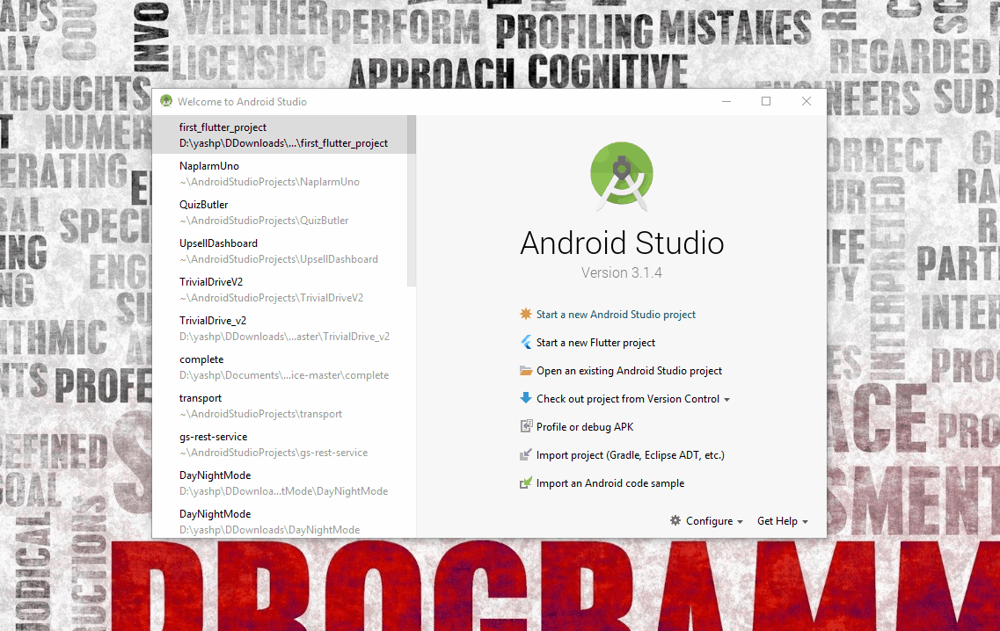
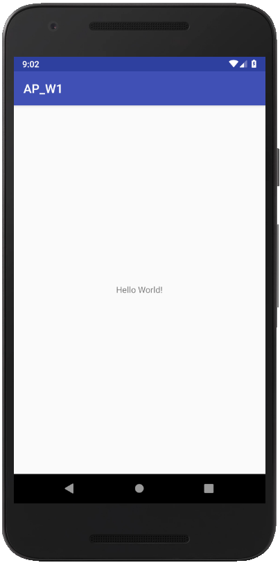
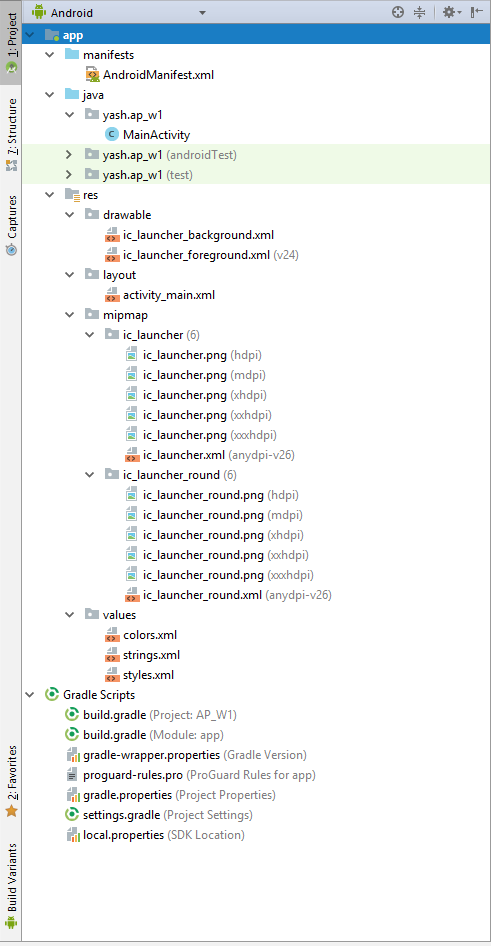

# Week 1 - Introduction to Android and Android Studio

Hey there, your journey to becoming an Android Pro begins now!

This week we'll learn the basics and fundaments of Android.

To develop Android Apps, we use the official IDE (Integrated Development Environment) for Android development called Android Studio.
 So lets go step by step, 
### Instaling Android Studio

- [Download Android Studio](https://developer.android.com/studio/) for Windows,Mac or Linux.
- Installation should be straight forward. For Windows, just run the download and the follow the setup wizard. You can check [this](https://developer.android.com/studio/install) out for a complete run down of the installation if you get stuck.
- You should hopefully see the welcome screen. Setup a new project like this. You can change the company domain to your name, but I'd recommend keeping the application name the same for now so it'll be easier to follow along. 

### Setting Up Your Android Device
To run our app, we need to setup our Android Device or create an emulator. I would recommend using your physical Android device as the emulator can be slow and unreliable. Plus personally, I think being able to touch and interact with it (as how the users would) really gives you a correct assesment of the UX.   Check out [this](https://developer.android.com/training/basics/firstapp/running-app) document for how to connect your device or create an emulator.

### Running the app
On running the app, the app should be installed onto your device and would open automatically. The contents of the app should look somewhat like this.

Cool so you've basically set up everything! As you can see, when you created the project, Android Studio already made the default "Hello World" app for you. Let's have a look at the files which have been generated for this default app.

### Project Files
Have a look at the files pane on the left side of your window. It consists of a bunch of different folders & files. Currently, it should look something like this.

If you look under the app module, you'll see 3 main groups. 
 **manifests** 
Contains the AndroidManifest.xml file. It's an important file which we'll be looking at in more detail later in Week 4.
 **java** 
Contains the Java source code files, separated by package names, including JUnit test code. Week 3 is dedicated to the Java part of   Android app building, so lets leave that for now.
 **res** 
Contains all non-code resources, such as XML layouts, UI strings, and bitmap images, divided into corresponding sub-directories.       We'll be working with XML layouts in Week 3. For now, lets take a closer look at the other files present here.

- drawable : this is where we put in stuff like bitmap files (.jpg, .png, .gif) etc which can be put into our app locally. You'll be adding stuff to this in Week 2
- mipmap : this is where we put our app launcher icon (on which you click to launch the app). You'll see multiple ic_launcher.png files here. Why do we need more than one file of the same image? Well if you open the files, you'll see they are different sizes actually. Depending on the resolution of your display, an apporpriate sized image is taken.
- values: Consists of XML files that contain simple values, such as strings, integers, and colors.
  - Here you can see there is a file colors.xml defining color names along with their hex values. **colorPrimary is mapped to the color of the Action Bar, whereas colorPrimaryDark is mapped to the color of the status bar.**
  - strings.xml is used to store string constants such as the name of the app.
  - styles.xml defines the theme of the app. e.g. Say you want to hide the action for an app. You can change the theme here to one with no action bar.

Outside our app module, we have a few build files. These are generated by the build tool which Android Studio uses, Gradle. For now, think of Gradle as the thing which compiles all your java classes, xml code etc and makes the APK which is installed on to your device.  Let's have a look at the build.gradle file. You'll see two files, one at the project level (Labelled 'Project: AP_W1'), and one at the module level (Labelled 'Module: app'). We'll be editing the module level build.gradle file most of the time. You'll see a bunch of confusing stuff here, but you might understand some parameters like the minSdkVersion which is set to 21. SDK 21 corresponds to Android 5.0 Lollipop. This means only apps running Android 5.0 & above can use this app. Further,the app versionCode and versionName is also mentioned here. versionCode is a whole number and this is what the system uses to version the project. versionName is what is shown to the user and can be anything you want.

**Suggested Reading:** [Configure your Build](https://developer.android.com/studio/build/) 

**But here's my two cents on this.** 
Gradle is a complicated topic. You'll start understanding more as you interact with it while building apps, but even if you don't that's alright! In the end, its there to make your life easier, and as long as you have a fair idea of what it does, please don't break your head on it. XD  
Still, leaving questions unanswered is not a correct way to start learning a new topic. So check out the above link, it should clear a lot of your doubts. You can always ask me anything if you still have any questions.

So that's it for this week! You've made great progress having learned all the stuff you need to start development!

### Make sure you check the assignments in the 'assignments' folder and complete them before the deadline!

