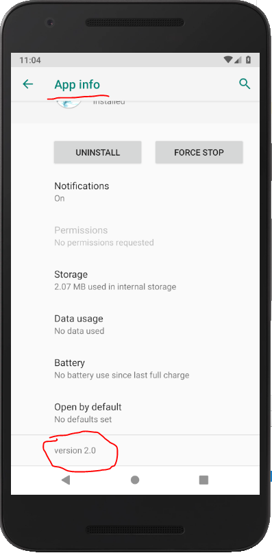

### Week 1 Assignment 
Alright, so here is your week 1 assignment. Most of them tasks are very easy and you should be able to do them just by reading the material for this week. The last one (marked bonus) is also related to what I've said, but to implement it, you might need to read a bit more. Obviously, its called bonus for a reason...extra marks will be awarded for completing it. However, make sure you atleast complete the main tasks before the deadline.

1. Change the color of the action bar & the status bar.
2. Change the title of your app.
3. Change the version name of your app (e.g. from 1.0 to 2.0)
4. BONUS: Change the app icon from the default to something else. HINT: [Image Asset Studio](https://developer.android.com/studio/write/image-asset-studio#about)

Your app should look something like this:

Inside the app: 

App Info in Settings: 

Icon in Launcher: 

### Submissions will be accepted on Edmodo. You'll see a section to turn in your assignment for Week 1. Take screenshots similar to the ones shown highlighting the changes made. Make sure you complete all the tasks and then take the screenshots.
