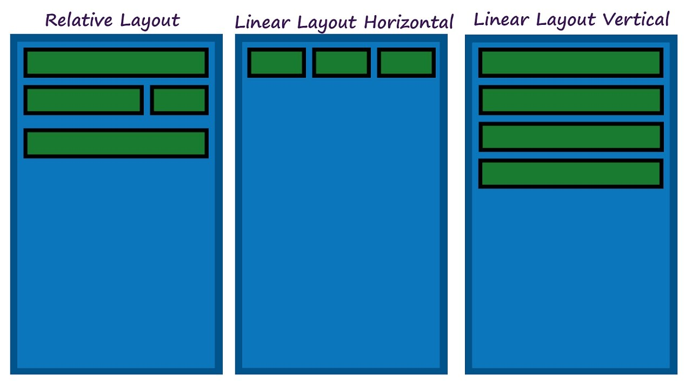

# Week 2 - Creating layouts using XML

#### A week down, 3 more to go! This week we learn about XML Layouts.

#### Link to this week's video : \*will be added here\*

*Note: Before starting, I’d like to tell you the format for this week’s content is a bit different from that of the last week. This week, I’ll be running over the entire contents of the week but not provide you with a detailed explanation for each part.  
Instead, I’ll be putting links to documents explaining the topic. The reason being, the links here are from the best websites around the internet where frankly you’ll find the most thorough explanation there is, better than what I can probably give.  
Also, I’d like you to get familiar with using the Android Developers Website ( https://developer.android.com ) as going forward, it’s going to be your most helpful tool! It has everything from beginner tutorials to documentation for the most complex classes. So when you’re stuck, it’s a good place to begin. 
However, for someone just starting off, the site can get a bit overwhelming with some random terms everywhere. So, for now, I’ll be giving you direct links to the pages & sections which you should read. You are however ~~welcome~~ encouraged to explore beyond.*

So literally every element you can view and interact with in the app is defined in a language known as XML. XML stands for **extensible markup language.** Think of it similar to HTML, except the tags in XML do not have a pre-defined meaning and are dependent on the platform. 

**Suggested Reading:** [Introduction to XML](https://www.w3schools.com/xml/xml_whatis.asp)

Have a look at this week’s video. I have given a basic explanation of how layouts work.
To summarize, layouts consists of two main parts, Views & ViewGroups. Views are what we see & interact with (e.g. buttons, textfields etc) whereas ViewGroups are containers which hold the views – deciding how they are arranged.

**Suggested Reading:** [Basic Overview of View and ViewGroups](https://developer.android.com/guide/topics/ui/declaring-layout)

The first step is to learn a few different views we can use. The most important ones are TextView, EditText, Button & ImageView. We’ll also be using some others like ImageButton, RadioButton, CheckBox occasionally depending on our use. 

Check out the link below for a useful list of views along with the code to implement them. Don’t worry if you don’t understand the code right now, we’ll be seeing that later. Make sure you explore the different attributes of these views though – width, height, text and check out the possible values.

**Suggested Reading:** [Android Views](https://www.formget.com/android-views/) 

Now that you have an idea of the views, lets take a look at ViewGroups. We’ll be learning about two types of ViewGroups this week, LinearLayout and RelativeLayout. 

Let’s start with LinearLayout.

[LinearLayout](https://developer.android.com/guide/topics/ui/layout/linear) : This arranges views in a linear order, either horizontally or vertically. It’s probably the easiest to implement yet very powerful and is used even in complex layouts. Follow the link to learn more on Linear Layouts.

Check out the example code at the above link, you’ll see that there is an outer LinearLayout tag, inside which there are multiple views (3 EditText and a Button). The linear layout has its attribute set to vertical which means the views are arranged one below the other.

Understanding and even writing the code is important, but to start off we can make use of a super cool tool in Android Studio – Layout Editor! Using this, making layouts can be as easy as drag and drop. 

**Suggested Reading:** [Using the Layout Editor](https://developer.android.com/studio/write/layout-editor)

LinearLayout is a very useful & powerful ViewGroup but it has some limitations. Let’s say we wanted text somewhere on the extreme top of the layout and then some at the extreme bottom. Linear Layout only allows us to place elements one below the other. For such a requirement, we can use a ViewGroup called RelativeLayout.

[RelativeLayout](https://developer.android.com/guide/topics/ui/layout/relative): Views are arranged relative to other views/elements. e.g. We can assign attributes to the view such as android:alignParentBottom="true" to move the view to the bottom of the screen. We can also set views in relation to other views, e.g. we can add an attribute like android:layout_toRightOf="@id/welcometext" to a view to assign it to the right of a view with ID "welcometext". Follow the above link for more on RelativeLayout.

Try making your own layouts now – your week 2 assignments will be based on creating layouts in XML.

One last thing. Did you know, the layouts you have created using the Layout Editor have generated XML code automatically? Just switch tabs from design to text at the bottom of the page. Try understanding the XML code and see how the attributes are defined. While creating complex nested layouts, the layout editor gets complex and you would have to edit attributes straight in the XML.

That’s it for this week. There’s a lot to self-learn this week, and I encourage you to explore the topics in more detail on your own. Your app now contains all the ingredients of a proper app such as text, images, buttons etc. But does your app perform any function? We’ll be looking at that next week.

**Tip:** You'll notice this week involves a lot of self-learning & exploring. Personally, I have learned all about Android App development through tutorials online, so I can give you a few tips to keep in mind while searching your doubts. 
Remember, any doubt you have, I can guarentee someone else has not just had that doubt, but answered it somewhere online. The key here is to word your doubt properly to find the answer. You'll probably find sites like StackOverflow most useful where someone has already asked the same question. If you can't find a similar question, try searching about the topic you're having a doubt with. Maybe some tutorial online has covered that point already. You might even learn something more in the process.
**Luckily though, you're not in this alone.** If you're still stuck, post your doubt in the WhatsApp group. I'll try my best to clear all your doubts. 

### Make sure you check the assignments in the 'assignments' folder and complete them before the deadline!
