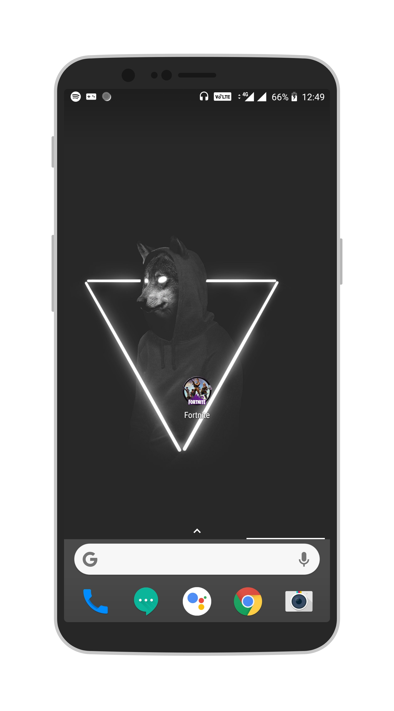

## Week 2 Assignment

To get started, create a new project in Android Studio.

Your week 2 assignment is based on XML Layouts. Your task is to design a layout of your own.  
**You're given full freedom in choosing what you want to make. There is no right or wrong in this assignment.**

Marks will be allotted for your creativity, design as well as your choice of elements. **Here are some important guidlines you should follow**:

- Include atleast 4 different types of views in your layout. Views, as you should know, are stuff like TextView, Button, EditText etc. You can have as many views as you want, but 4 is the minimum.
- You can use any ViewGroup you want - LinearLayout or RelativeLayout or both, whatever suits your needs.
- Please make the app look asthetically pleasing. Pay special attention to stuff like background color, font size, view allignment e.t.c. Don't forget to choose suitable colors for your ActionBar and Status Bar and give a suitable logo to your app, just like how you did in Week 1.

Like I said, you can create anything you want. However, for the less creative ones out there, here is a sample.

Just like week 1, submissions will be accepted on Edmodo. You'll see a section to turn in your assignment for Week 2. Take screenshots similar to the ones shown highlighting the changes made. Make sure you complete all the tasks and then take the screenshots.
Submission 
