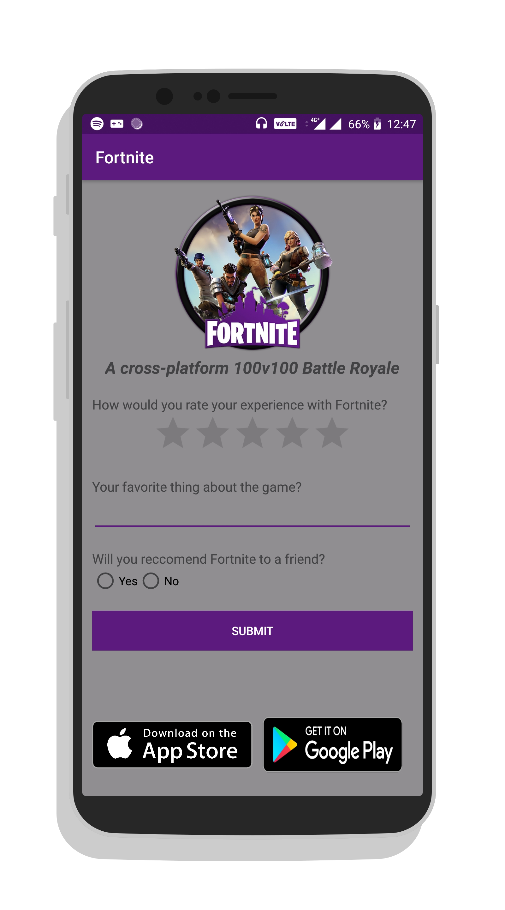
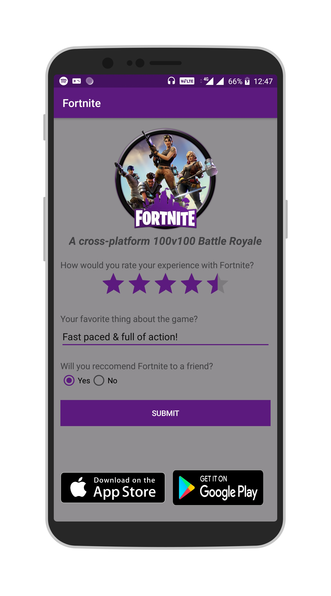
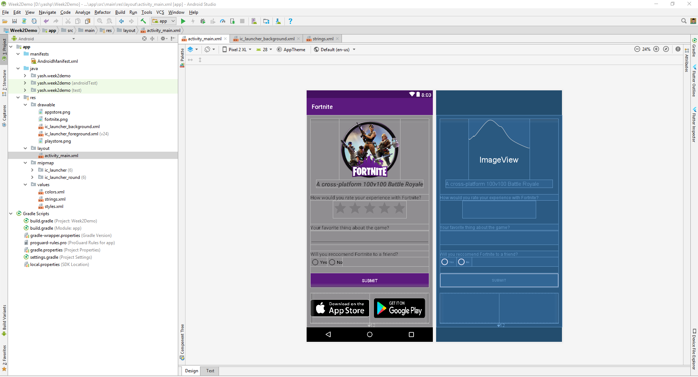

## Week 2 Assignment

To get started, create a new project in Android Studio.

Your week 2 assignment is based on XML Layouts. Your task is to design a layout of your own.  
**You're given full freedom in choosing what you want to make. There is no right or wrong in this assignment.**

**Here are some important guidelines you should follow: **

- Include atleast the following 4 types of views in your app: 
  - TextView
  - EditText
  - ImageView
  - Button
 Of course, you are free to add more views, but these 4 are the necessary ones.
- You can use any ViewGroup you want - LinearLayout, RelativeLayout or both, whatever suits your needs.
- Please make the app look asthetically pleasing. Pay special attention to stuff like background color, font size, font color, view allignment e.t.c. Remember to choose suitable colors for your ActionBar and Status Bar, just like how you did in Week 1.
- Submissions will be accepted on Edmodo. You'll see a section to turn in your assignment for Week 2. **Take a minimum of 3 screenshots and upload it there**, showing 
1) state of your app on launching it
2) state after interacting with the user (e.g. filling in details in EditText)
3) screenshot of your Android Studio development environment with the file actvity_main.xml open - this can be taken using a tool like snipping tool on Windows.
- **Remember, marks will be allotted for your creativity, design as well as your choice of Views & ViewGroups.** Think of this similar to an English exam where you have to write an essay - your marks are simply dependent on the quality of your content, there is no right or wrong. So although you have full freedom in creating what you want, if you make your layout too simple...that's technically ok, but expect marks accordingly. At the same time remember to keep the layout clean & don't just add views because you can...make it something sensible!

For your reference, here is a sample. This is also how you should take your screenshots for submitting the assignment.

## Deadline: 3:30pm - Friday, 31st August 2018. Please submit your assignments before this to avoid late submission penalty.
