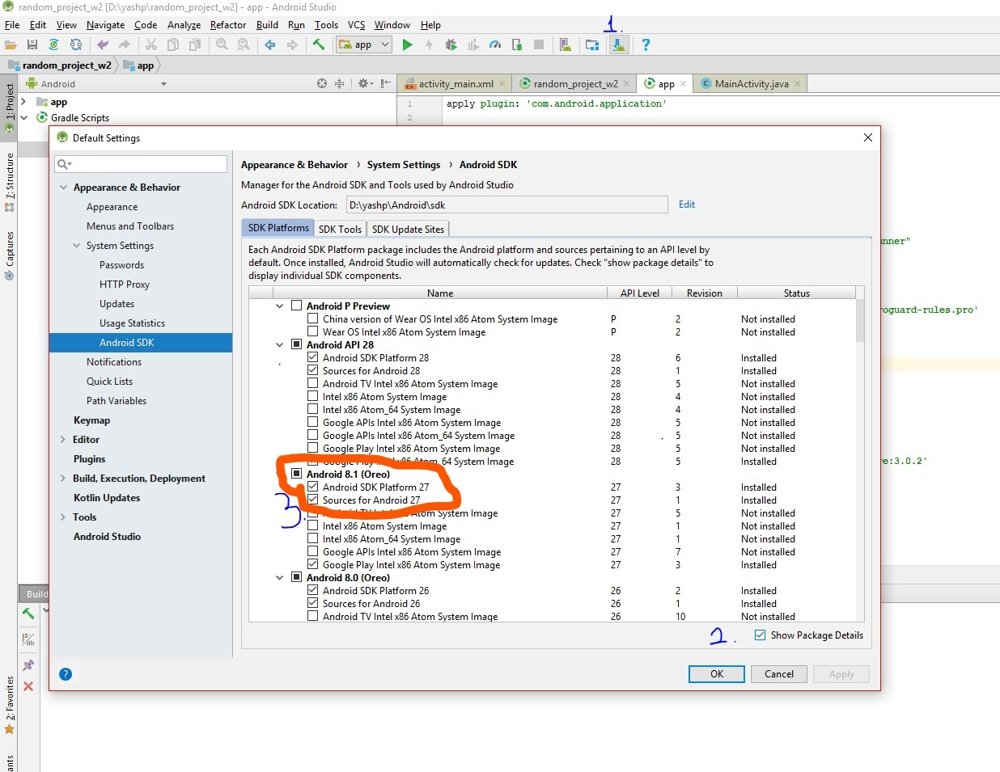

## Fixing problem where layout editor is blank.

Some of you may face this problem where the layout editor is blank even though you have added views to the layout. 
 
The problem is actually with one of the support libraries in the SDK 28 platform - which is still not stable. 

Anyway, fixing the problem is easy.

### Step 1 - Install SDK Platform 27 
 
- Open the SDK Manager by clicking on the icon (1).
- Expand the packages by clicking show package details (2).
- Tick the first two boxes under Android 8.1 as shown. (3). If its already ticked, then ignore this step.
- Click apply. You'll start downloading platform 27. Let it download completely.

### Step 2 - Change build.gradle file 
 
- Make changes to the build.gradle file where highlighted in the picture. The final build.gradle file should look like that. Don't forget to sync your project.

Your problem should now be fixed, and your layout editor should reflect the views you've added. 

