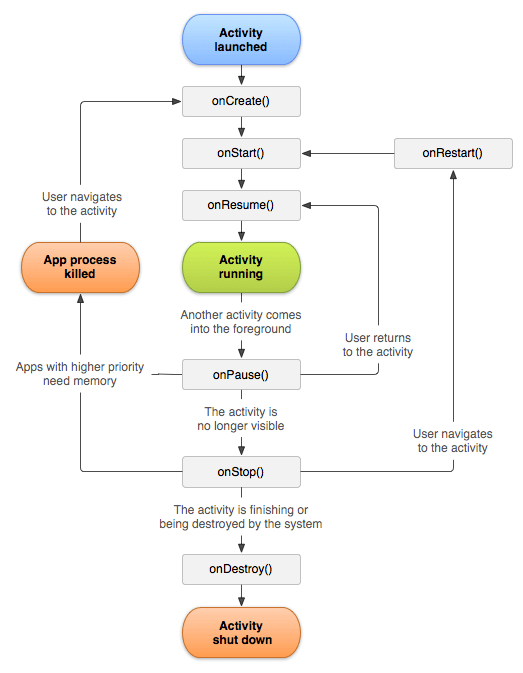

# Week 3 - Understanding Activities with Java

#### Great going! You're halfway through the course now! In fact, once you complete this weeks course, you'll be able to make complete apps.

#### Link to this week's video : https://drive.google.com/open?id=1iFlht4lht25IKnUkMelgfbrttbh63uqJ

Last week, you guys designed the layout for your apps using XML. Your apps probably look complete now...but if you think of it, do they actually perform any functions? When you enter information and click a button, does it actually do anything? Well its time to do just that!

Lets start by having a look at the java folder in our project. You'll have a java file named **MainActivity.java** . If you guys have studied a programming language like C++, Python or Java before, you should be familiar with the concept of classes. MainActivity is nothing but a class. This class is used to define something called an activity in Android. You can think of activity as a screen in Android. Everything that happens in the activity is defined in the MainActivity.java file.

Now have a look at the methods in the activity. Right now, you'll see only one method called onCreate(). For simplicity, just think of it as a special method which runs whenever the app starts...i.e. you won't have to be calling it manually. Here are some of the other inherited methods avaiable to us and when they're executed. Feel free to explore the same!



**Suggested Reading:**[Activity Lifecycle](https://developer.android.com/guide/components/activities/activity-lifecycle)

Anyway, there are already a couple of stuff there. You'll also find an explanation to the above stuff in the link above. Lets not mess around with it. One interesting line here though is *setContentView(R.layout.activity_main)* . *R.layout.activity_main* is nothing but the path of the XML layout file which you had last week. This is how the activity knows what layout to inflate.

Lets start off by trying to find a reference to one of our elements in the layouts. The general procedure is:
1) Create an object of the view class
2) initialize it to the view returned using the findViewById() method
3) Access the methods of the class through the object.

Example:
```java
Button bt;
bt= findViewById(R.id.button);
bt.setText("Click Me!")
```

Let's have a look at another important concept now...starting a new activity. For any useful app, you can't possibly fit the entire app on one screen.
To start a new activity, we use something called Intents. Intents carry information required for the transition of the activity. We can also pass extra information through intents. So through intents, our activities can even communicate with each other.

**STRONGLY Suggested Reading:** [Starting a New Activity](https://developer.android.com/training/basics/firstapp/starting-activity)

That's the basic crux of Week 3. I'll be also be uploading the demo project I had created during the GD in the ***code*** folder.

### Make sure you check the assignments in the 'assignments' folder and complete them before the deadline!
