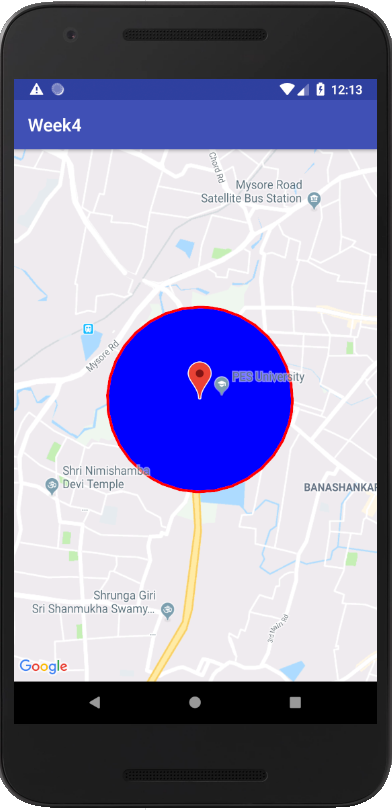

## Week 4 Assignment

Your week 4 assignment is based on using Google APIs - more specifically you'll be making use of the Google Maps for Android API. 

**Instructions:**
- Create a new project. It should just be an empty activity.
- Now add a map to this activity using SupportMapFragment view.
- Place a marker at your home location. 
- BONUS: Draw a circle around your map (of any radius).

Submit just one screenshot of your final result, something like this:
 

## Deadline: 10am - Saturday, 29th September 2018. Please submit your assignments before this to avoid late submission penalty.
